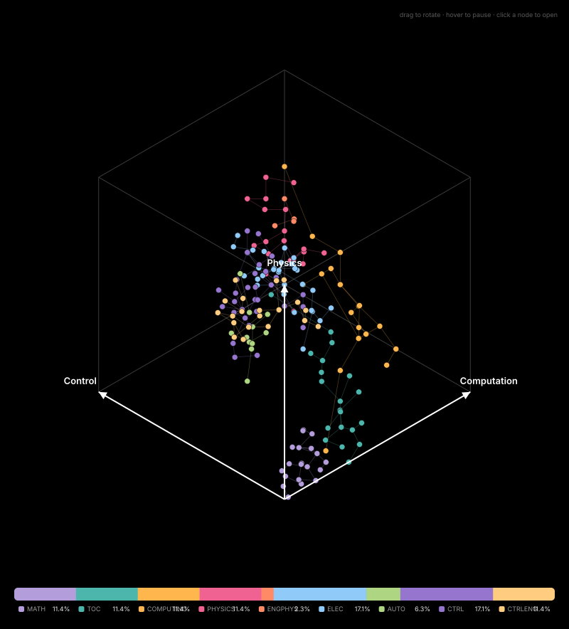

#  Hi, I'm rootkiller6788  👋

---

  <picture>
    <source media="(prefers-color-scheme: dark)" srcset="./assets/vibe-coding-dark.svg">
    <source media="(prefers-color-scheme: light)" srcset="./assets/vibe-coding-light.svg">
    
  </picture>

  <a href="https://github.com/search?q=author%3Arootkiller6788&type=pullrequests">
    <picture>
      <source media="(prefers-color-scheme: dark)" srcset="./assets/oss-contributions-dark.svg">
      <source media="(prefers-color-scheme: light)" srcset="./assets/oss-contributions-light.svg">
      
    </picture>
  </a>

# Autonomous Engineering Manifesto

## Overview
Software is entering a new era.

The past generation optimized individual developers with better tools. The next generation will build autonomous engineering systems that transform how software is created.

The future of software engineering is no longer limited to **writing code faster**. It lies in building reliable, intelligent systems that can **understand, execute, verify, and continuously improve** engineering work independently.

## Core Evolution Path
My research and practice focus on building the foundational framework for **AI-native engineering**, following a progressive technical evolution path:

**Mathematics → Computation → Systems → Intelligence → Autonomy**

## Technical Pillars
To reshape the modern software production paradigm, the system is built on five core technical pillars, enabling AI agents to serve as reliable, professional engineering collaborators:

- **Autonomous Harness**
- **Agent Runtime**
- **Formal Verification**
- **Engineering Knowledge Graphs**
- **Closed-loop Control Loops**

## Vision &amp; Mission

### Goal
This paradigm is **not to replace human engineers**, but to amplify human creativity and productivity through scalable, verifiable, and self-improving engineering systems.

### Paradigm Shift
The software industry is undergoing a fundamental transformation:

**From individual manual coding → Autonomous engineering infrastructure**

## Final Thesis
The next generation of software is not written by humans or AI alone — it is built by intelligent systems designed and guided by humans.

## Tech Stack

)

---

  Constructed under bare-metal discipline by <a href="https://github.com/rootkiller6788"><strong>rootkiller6788</strong></a> 
  All projects are open source under MIT License unless otherwise specified

