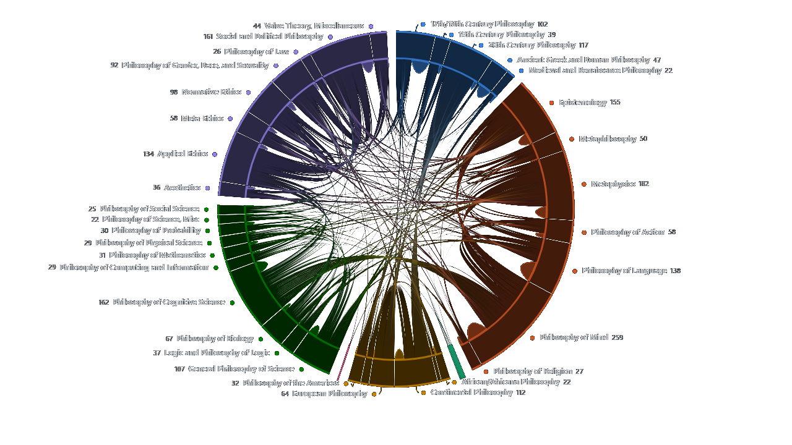
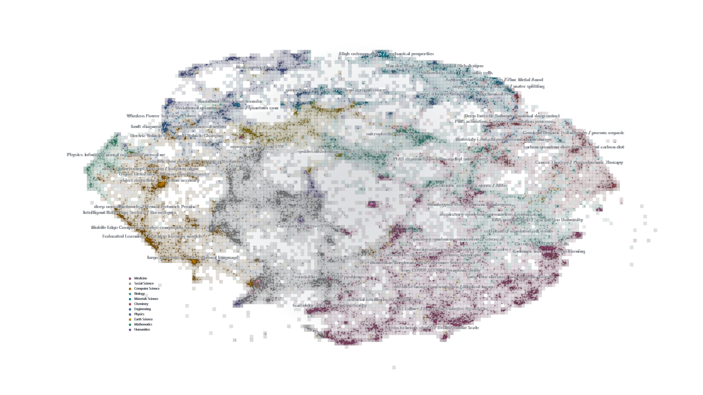
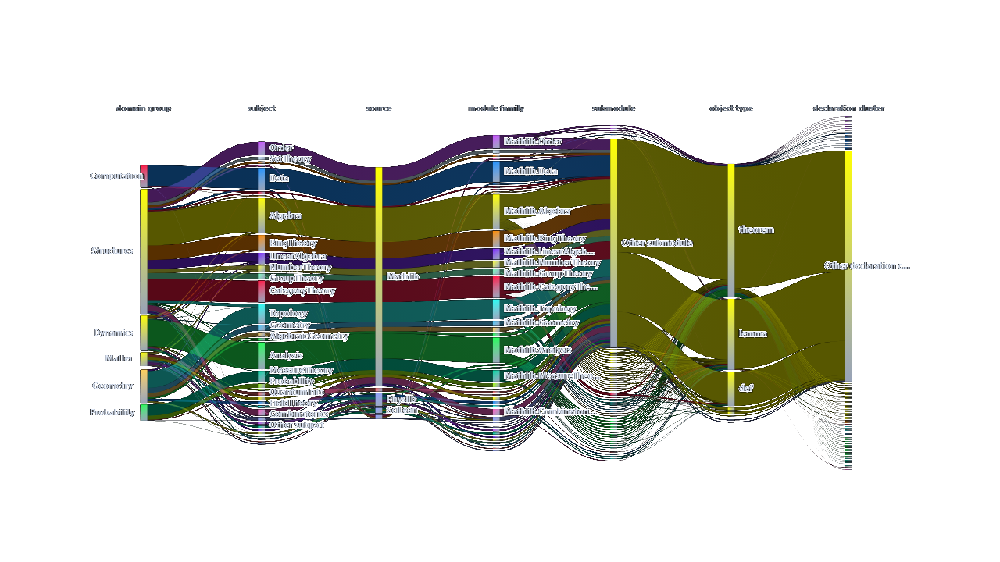
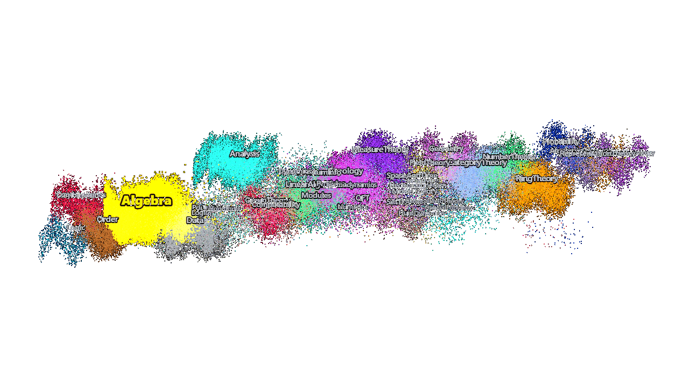
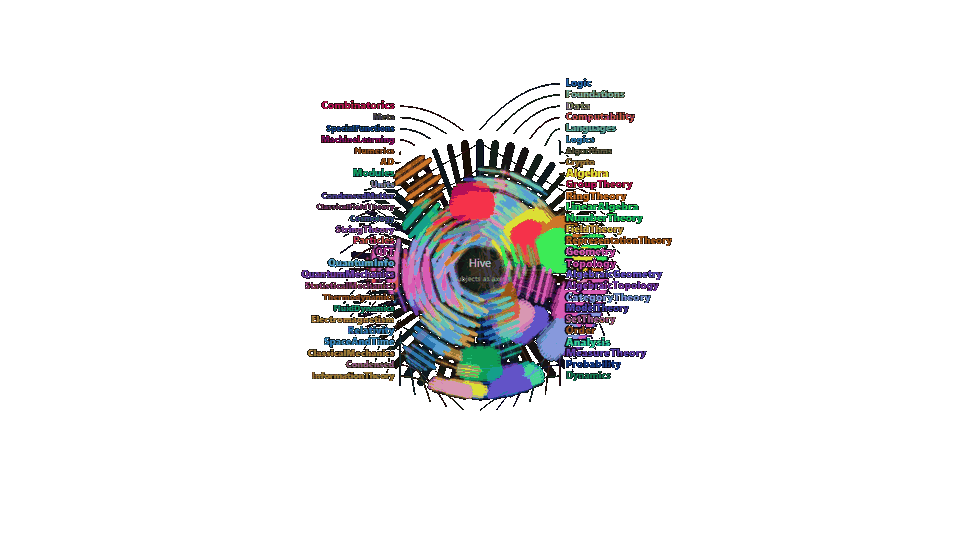
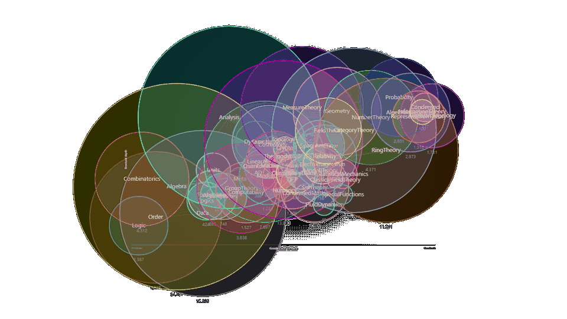
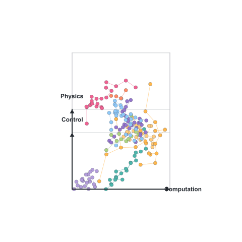
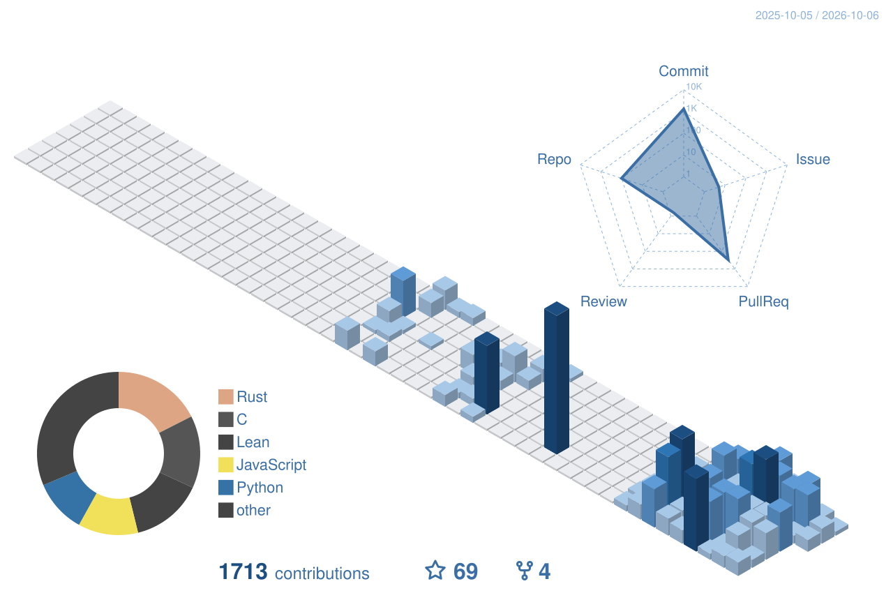

#  Hi, I'm rootkiller6788  👋

---

# Unified Science Map

 
 

   
  

   
  

   
  

   
  

   
  

   
  

  <strong>40,396 commits · 841 contributors</strong>

Lean theorems and definitions color‑coded by discipline with real import dependencies. Cyclic category zoom reveals the hierarchical, interactive declarative knowledge network of mathematics, physics and computer science. [UnifiedScienceMap](https://github.com/rootkiller6788/UnifiedScienceMap/)

---

# Autonomous Engineering Manifesto

<picture>
  <source media="(prefers-color-scheme: dark)" srcset="assets/coord-dark.gif">
  
</picture>

## Overview
Human work is entering a new era.

The previous age enhanced individual workers with improved tools. The coming age will deliver autonomous systems that redefine how human labor is carried out.

The future of productive activity is no longer merely completing routine tasks more quickly. It rests on constructing dependable intelligent systems capable of comprehending, executing, validating, and steadily refining work independently.

## Core Evolution Path
My research and practice aim to establish the foundational framework for AI-native autonomous operation, following a progressive technical evolution path:

**Mathematics → Computation → Systems → Intelligence → Autonomy**

The rotating coordinate system to the right maps my technical landscape across three axes — **Computation**, **Physics**, and **Control**. See [DETAILS.md](./DETAILS.md) for the full breakdown.

## Vision &amp; Missio
Autonomous systems will take over all repetitive, low-value standardized labor, liberating humanity from mechanical and burdensome tasks so people can focus on creative, high-order exploration. Complex undertakings will ultimately be led by humans and accomplished collaboratively with intelligent autonomous systems.

  

## Tech Stack

)

---

  Constructed under bare-metal discipline by <a href="https://github.com/rootkiller6788"><strong>rootkiller6788</strong></a> 
  All projects are open source under MIT License unless otherwise specified

